## 后台管理子系统用户手册

 手册修改记录：

| 修改日期  | 版本  | 修改页码、章节、条款 |      修改描述      |  作者  |
| :-------: | :---: | :------------------: | :----------------: | :----: |
| 2021-5-19 |  0.1  |                      |    创建所有条款    | 缪文俊 |
| 2021-5-31 | 0.1.1 |                      | 增加数据库备份相关 | 赵家成 |
|           |       |                      |                    |        |

### 一、编写目的

编写此手册的目的是为了对使用此系统的用户提供正确的使用方法，由于本系统为博物馆应用系统的 子系统，并且由于本系统的特性，本系统的主要功能对应用用户来说是透明的。所以，本系统的实际用 户为数据库运维人员。 

读者对象：数据库运维人员 

#### 项目背景 

子系统名称：后台管理子系统 

子系统任务提出者：北京化工大学信息科学与技术学院 

开发者：陈聘之、曾梅、缪文俊、侯士博、赵家成、史印武 

用户：数据库运维人员 

实现软件单位：计科1807-后台管理子系统小组 

#### 定义 

后台管理：在此子系统中，我们不仅使用数据库高效自动的管理数据，还可以通过后台的前端页面，通 过网页实现数据的查看和修改，以及数据库运行情况的监控。同时为了保护数据安全，当前端需要访问 数据库时，将通过调用后端http接口的形式，使用json页面接收和发送数据。 

#### 参考资料

1.后台管理子系统项目管理计划 

2.后台管理子系统需求规格说明 

3.后台管理子系统设计报告 

4.后台管理子系统测试报告 

5.《计算机软件文档编制规范》 

6.《计算机软件文档编制规范》 

7.孙家广学生文档范例

### 二、软件概述 

#### 目标 

后台管理子系统是博物馆应用不可缺少的部分，后台管理子系统为整个系统管理数据，并提供数据调用 和接收接口，并结合一些合理的触发器和索引，在一定程度上进行数据的保护和高效查找，同时也进行 数据库的备份，实现数据库被破坏时的有效还原。有效实时监控数据库运行状态，并提供前后端代码生 成接口，方便运维人员操作数据库和该网页框架。 

本系统主要分为三大模块： 

1.系统管理模块： 

功能：进行数据库的增删改查、进行页面布局的管理 

2.系统监控模块： 

功能：进行数据库系统性能监控 

3.系统工具模型： 

功能：连接数据库，直接生成前后端代码； 

#### 性能

 1.能够及时的响应用户的请求信息 

2.能够同时处理多个用户的请求信息 

3.能够存储大量的数据 

4.进行操作请求如:查找、删除、修改、添加时，应保证输入数据与数据库数据的相匹配性。而在满足用 户请求时，系统应保证所响应数的查全率与查准率。 

### 三、运行环境

#### 硬件

内存容量：2G 

输入设备：通过openssh进行远程链接操作并部署宝塔面板开放8888端口供可视化操作 

#### 支持软件 

操作系统：CentOS 8 

浏览器：Firefox，Chrome，safari 

数据库：mysql 8 

### 四、使用说明 

#### 使用条件 

服务端：安装mysql数据库，redis数据库，服务器或web服务器，Firefox浏览器，在有网络的条件下使用 

客户端：web服务器使用方法

#### 使用方法

1. 用户通过账号密码与动态验证码登陆系统

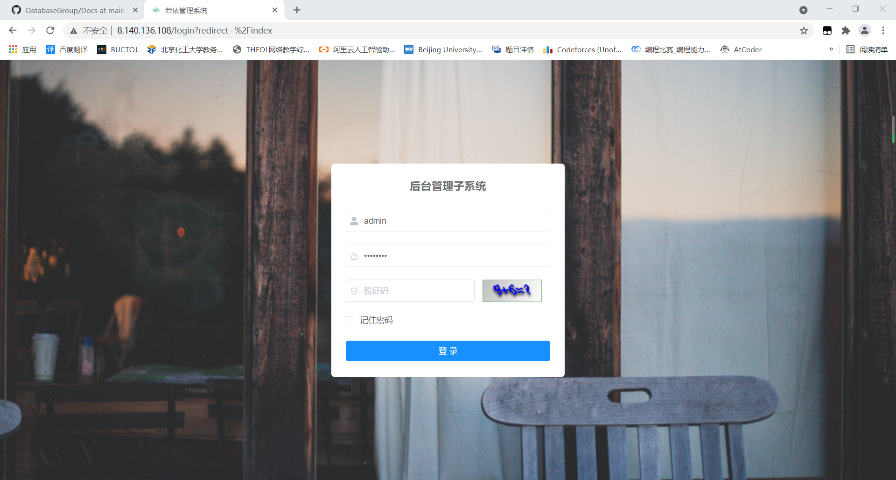

2. 登陆后主界面

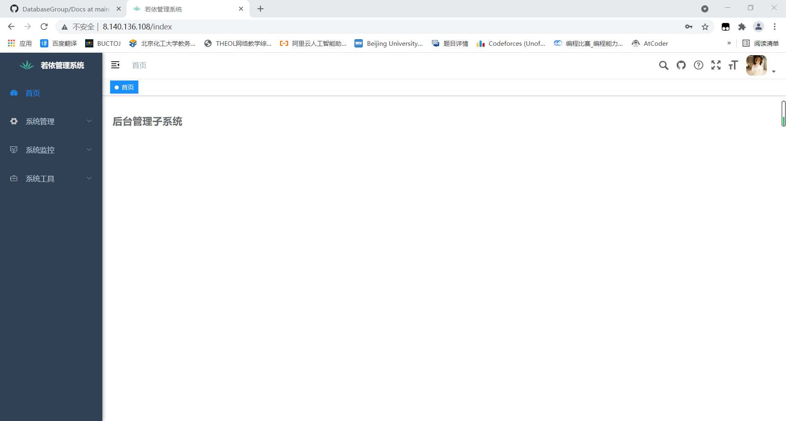

3. 后台管理员账号管理，可以实现增删改查，隐藏字段

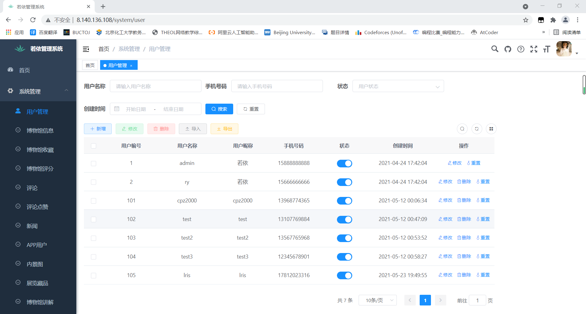

4. 博物馆收藏数据表，可以实现增删改查，批量导出

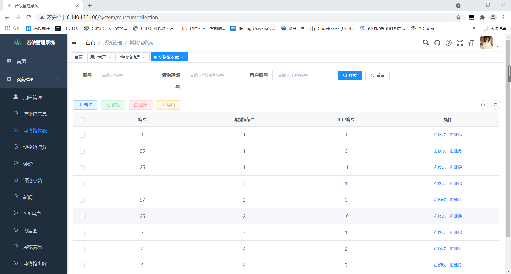

5. 博物馆评分数据表，可以实现增删改查，批量导出


6. 评论数据表，可以实现增删改查，批量导出

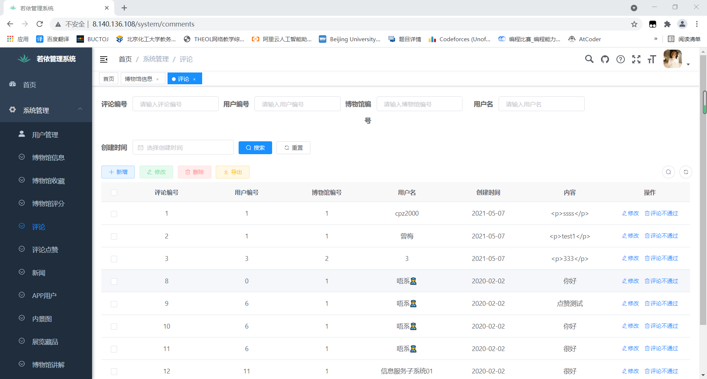

7. 博物馆信息数据表，可以实现增删改查，批量导出

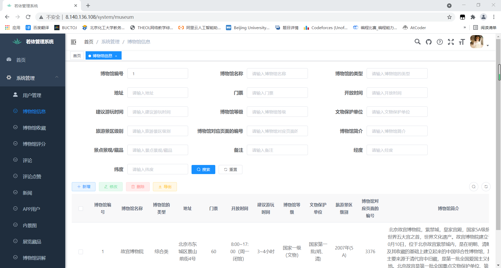

8. 评论点赞数据表，可以实现增删改查，批量导出


9. 新闻数据表，可以实现增删改查，批量导出


10. 手机端用户数据表，可以实现增删改查，批量导出

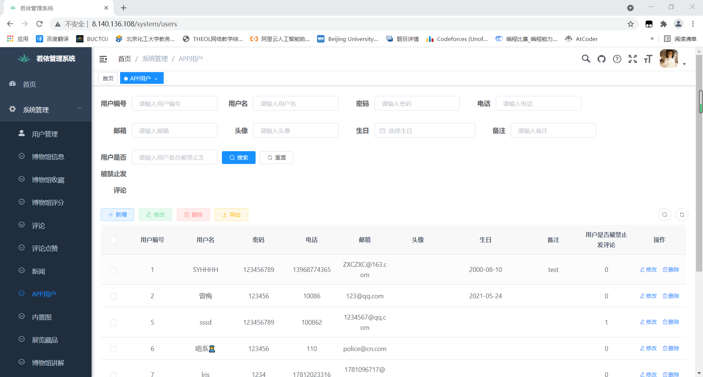

11. 内景图数据表，可以实现增删改查，批量导出


12. 展览藏品数据表，可以实现增删改查，批量导出

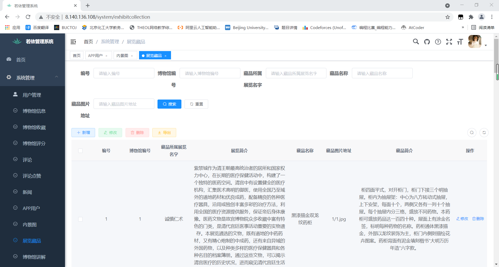

13. 博物馆讲解数据表数据表，可以实现增删改查，批量导出，同时在线观看图片，收听音频


14. 展览讲解数据表数据表，可以实现增删改查，批量导出，同时在线观看图片，收听音频

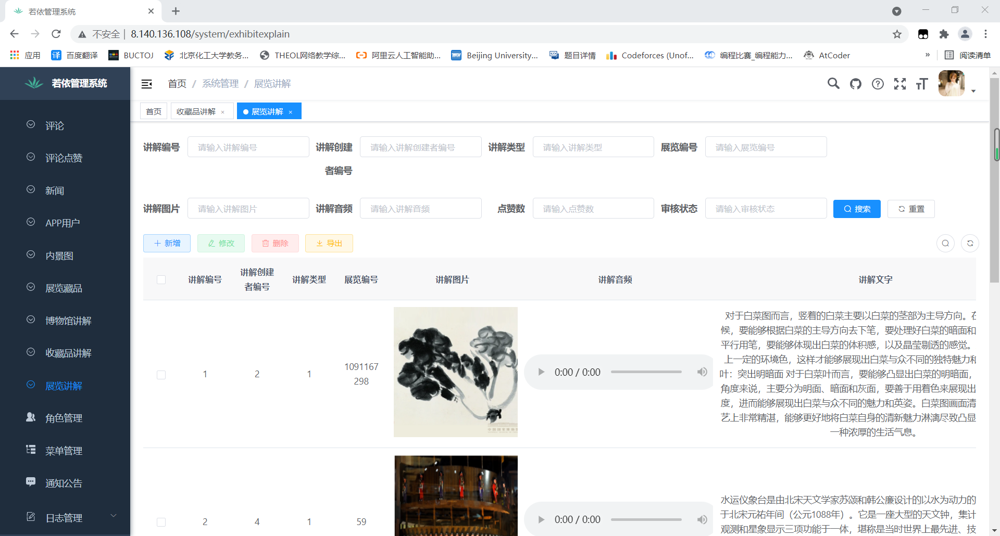

15. 收藏品讲解数据表数据表，可以实现增删改查，批量导出，同时在线观看图片，收听音频

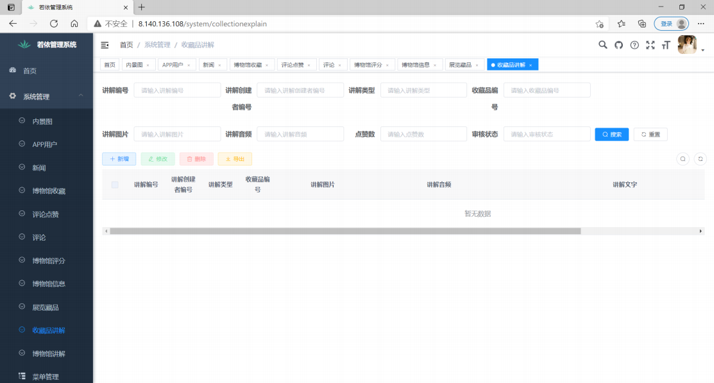

16. 菜单管理：实现前端页面的简单快速布局，批量导出


17. 操作日志：查看删除操作记录，批量导出

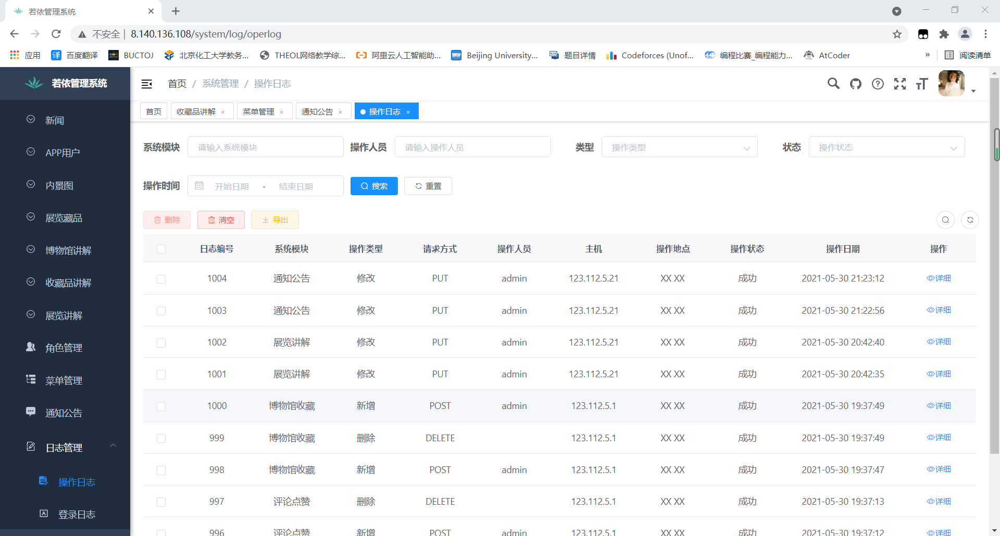

18. 登陆日志：查看删除用户登陆记录，批量导出

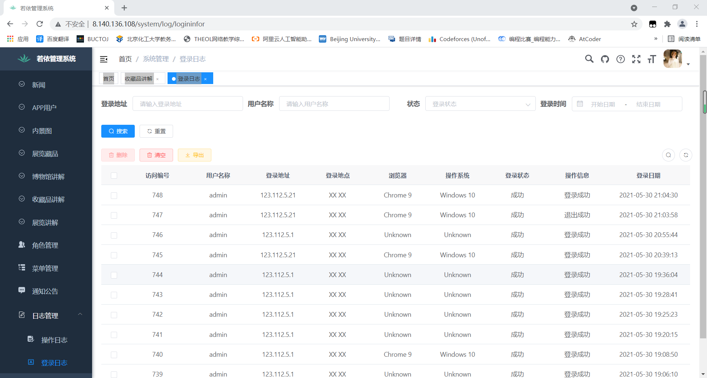

19. 查看在线用户人数，并可以强制使用户退出

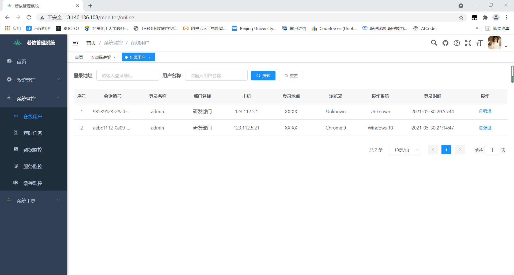

20. 监控与记录CPU、内存、服务器、虚拟机、磁盘等核心部件状态

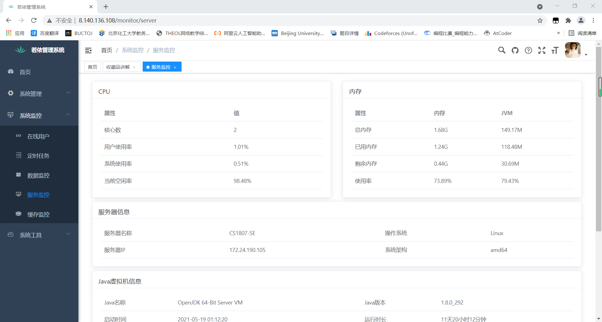

21. redis缓存数据库监控

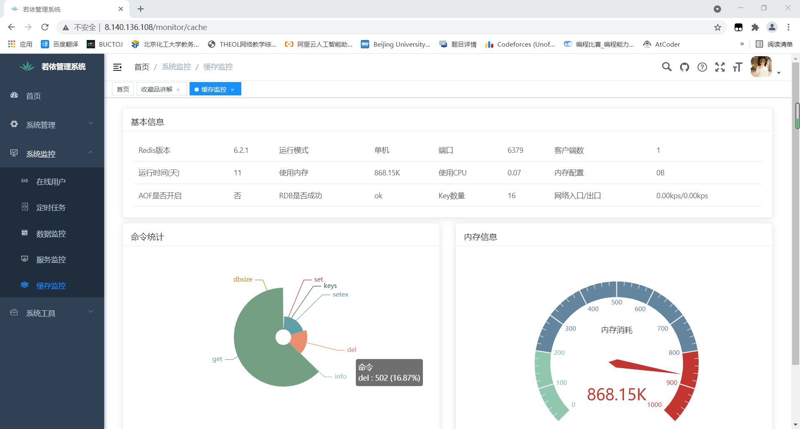

22. 连接数据库和该前后端框架，自动生成代码

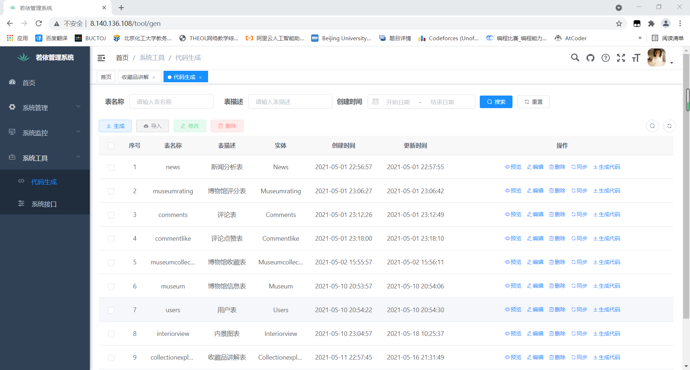

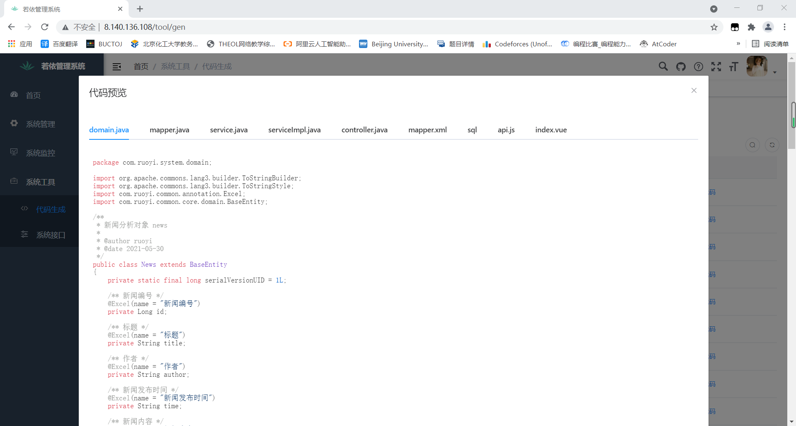

23. 通过令牌和指定接口访问获取数据 *相关接口内容在接口说明中详细展示

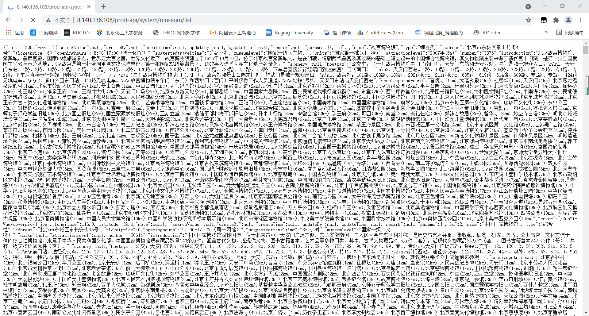

24. 设置系统定时任务，到点定时触发


25. 数据库备份还原操作

数据库的备份和还原分为两部分说明

+ 25.1 数据库备份（可视化）

备份可以通过Ruoyi构建的管理系统界面中，点击执行任务，也可以通过宝塔面板中预设的定时任务。

使用宝塔面板等服务器部署维护工具提供的定时任务执行设定好的备份可以避免因Java环境崩溃造成的定时任务失败。

可视化备份目前不能执行针对单个表的备份，由于数据量较大，全库备份耗时较长且可能诱发宕机。

+ 25.2 数据库备份（命令行）

要执行全库的全量备份，应在工作目录下执行：
```shell
mysqldump -u root -p rouyi-vue > rouyi-vue.sql
:password
```
要执行单表的备份，应在工作目录下执行:
```shell
mysqldump -u root -p rouyi-vue --tables tablename > tablename.sql
:password
```

由于共有42个表，因此若要以预生成```.sh```文件的形式，需要生成若干个，故建议手动视情况输入命令

+ 25.3 数据库恢复（命令行）

因为不是所有时候都需要进行灾难恢复，故我们认为这本身就是需要人工干预的操作，而且全库恢复负载压力过大，且会临时drop整个库造成较长时间的不可用，故我们均采取手工覆盖单表的方式。

若是采用Ruoyi或者宝塔面板自动备份的文件，还需先解压出sql文件并确定编码。

要执行全库的全量恢复，应在sql文件目录下执行：
```shell
mysql -u root -p rouyi-vue < rouyi-vue.sql
:password
```
要执行单表的恢复，应在sql文件目录下执行：
```shell
mysql -u root -p rouyi-vue < tablename.sql
:password
```

### 五、非常规过程

1、出错输出信息:

 根据不同的出错情况给出不同的出错信息，一般用对话框给出。 

出错处理对策: 

a、对一般错误，给用户提示信息，让用户重新输入或退出。 

b、对于严重错误，启动备份文件恢复，建议使用帮助文件